阅读下文有感： 

https://startupsventurecapital.com/essential-cheat-sheets-for-machine-learning-and-deep-learning-researchers-efb6a8ebd2e5

List of Cheatsheets: 
* Keras  
* Numpy  
* Pandas  
* Scipy  
* Matplotlib  
* Scikit-learn  
* Neural Networks Zoo  
* ggplot2  
* PySpark  
* R Studio  
* Jupyter Notebook  
* Dask  

1. Kearas  
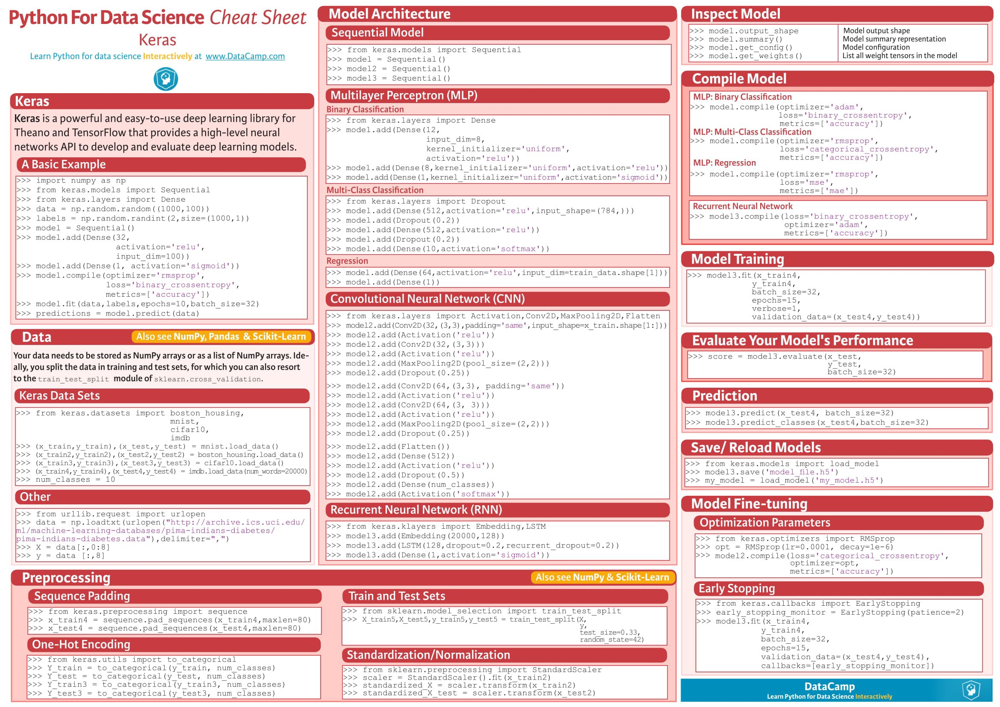  

2. Numpy  
  

3. Pandas   
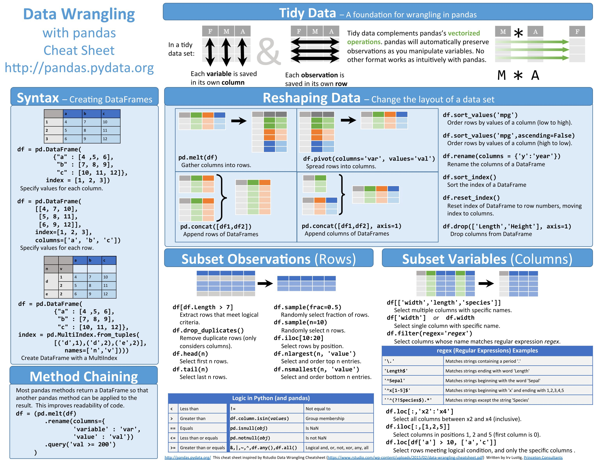  
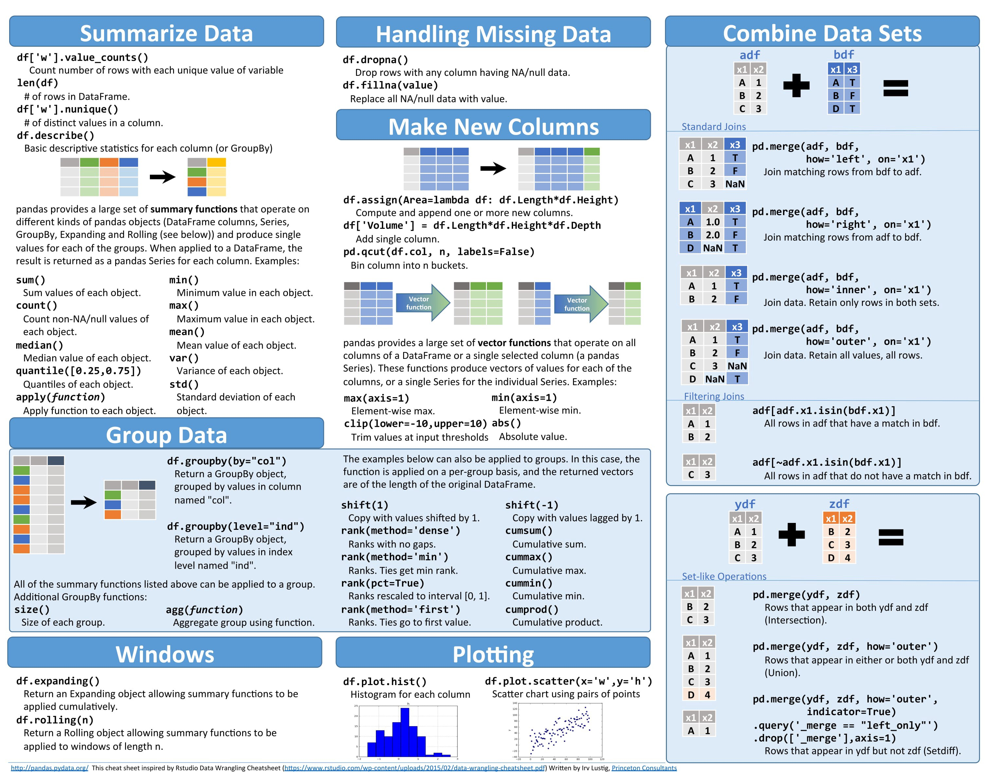  
   

4. Scipy  

5. Matplotlib  
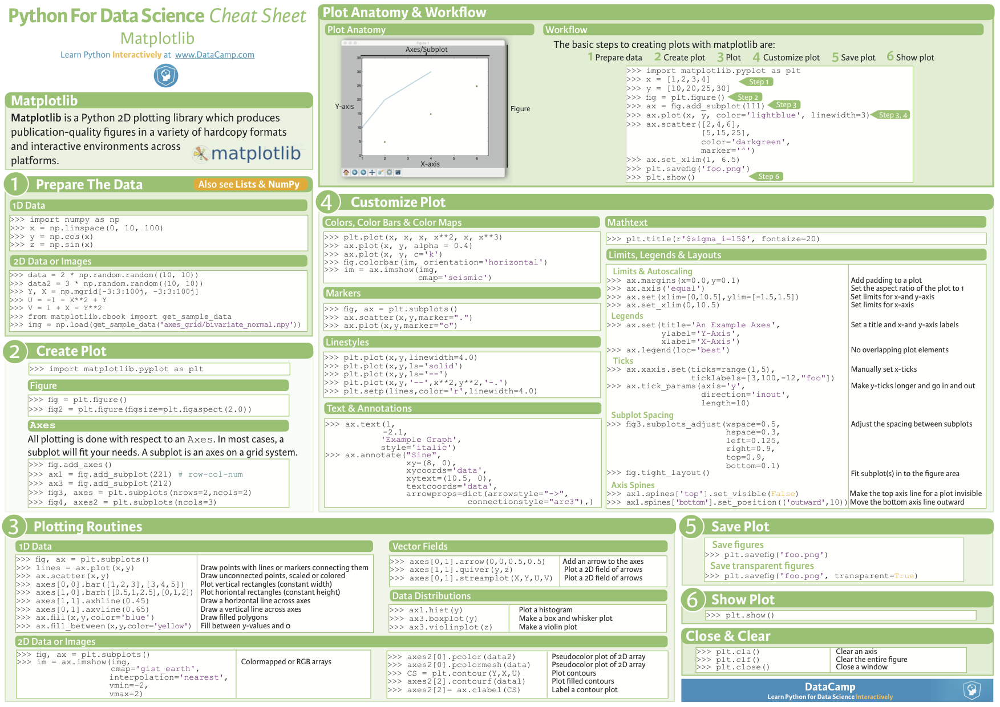  

6. Scikit-learn
  
 
7. Neural Networks Zoo  
  

8. ggplot2
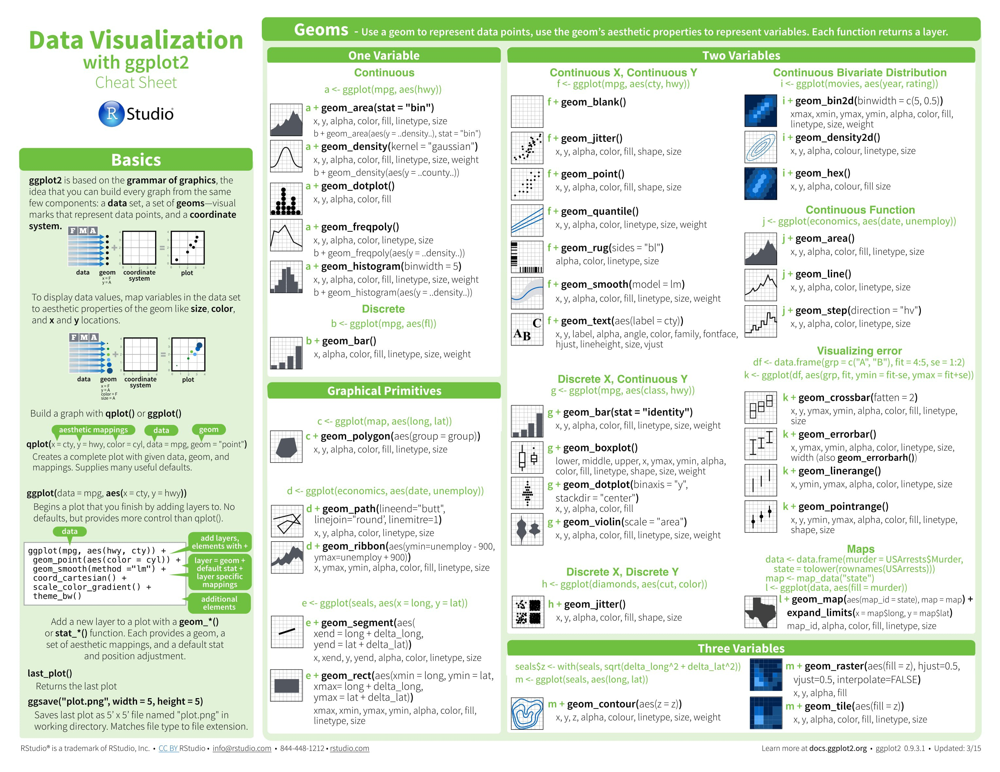  

9. PySpark  
  
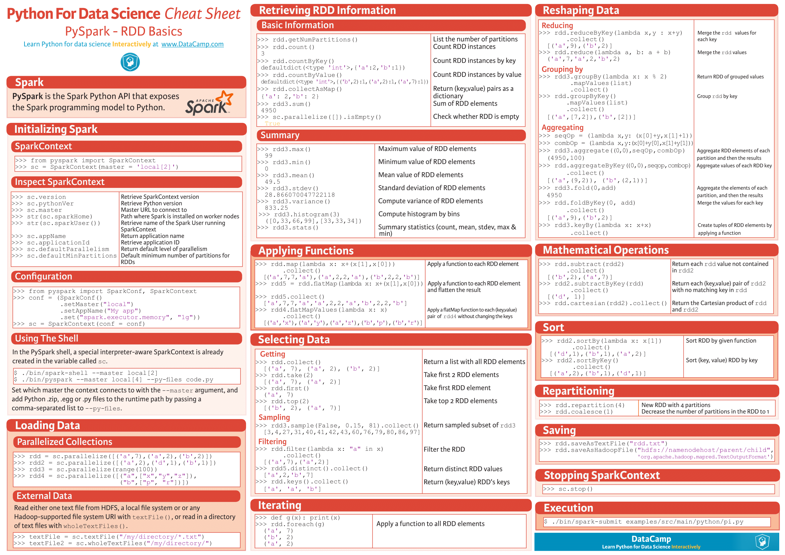  
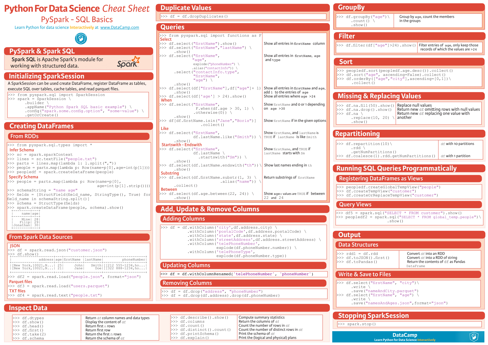   
 
10. R Studio  
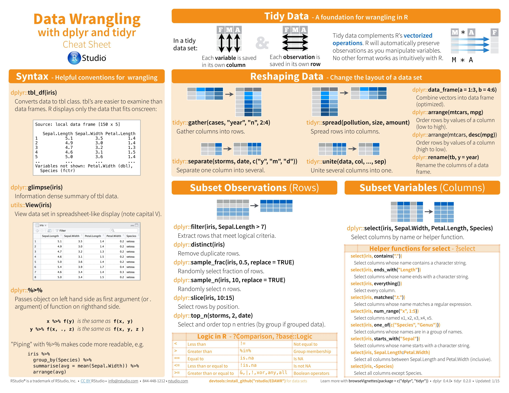 [R studio-2](pic/r2.jpeg)  

11. Jupyter Notebook  
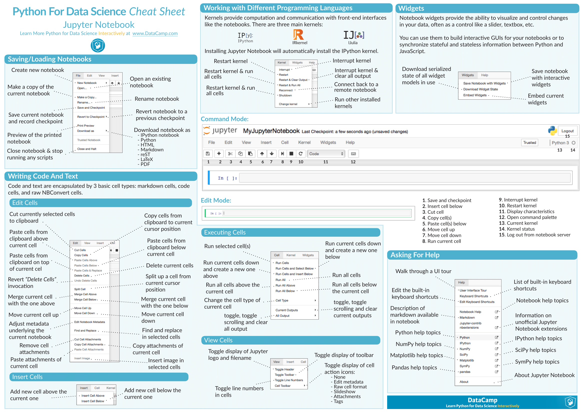  

12. Dask
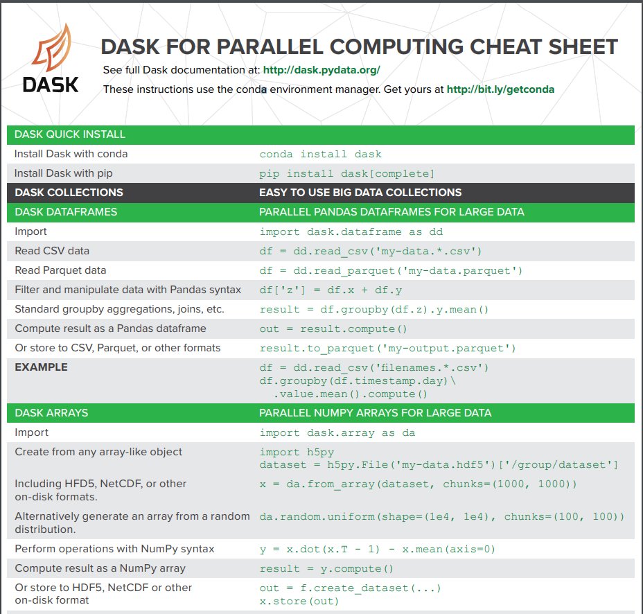  
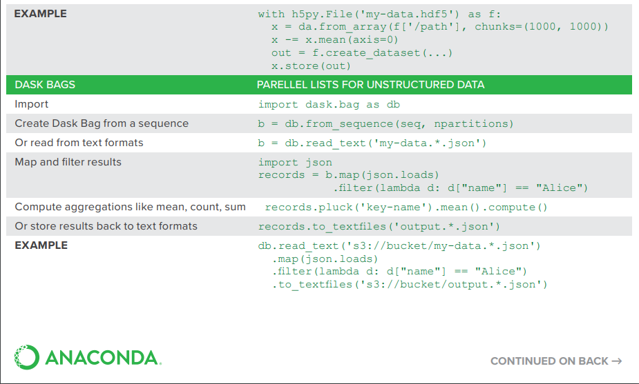  
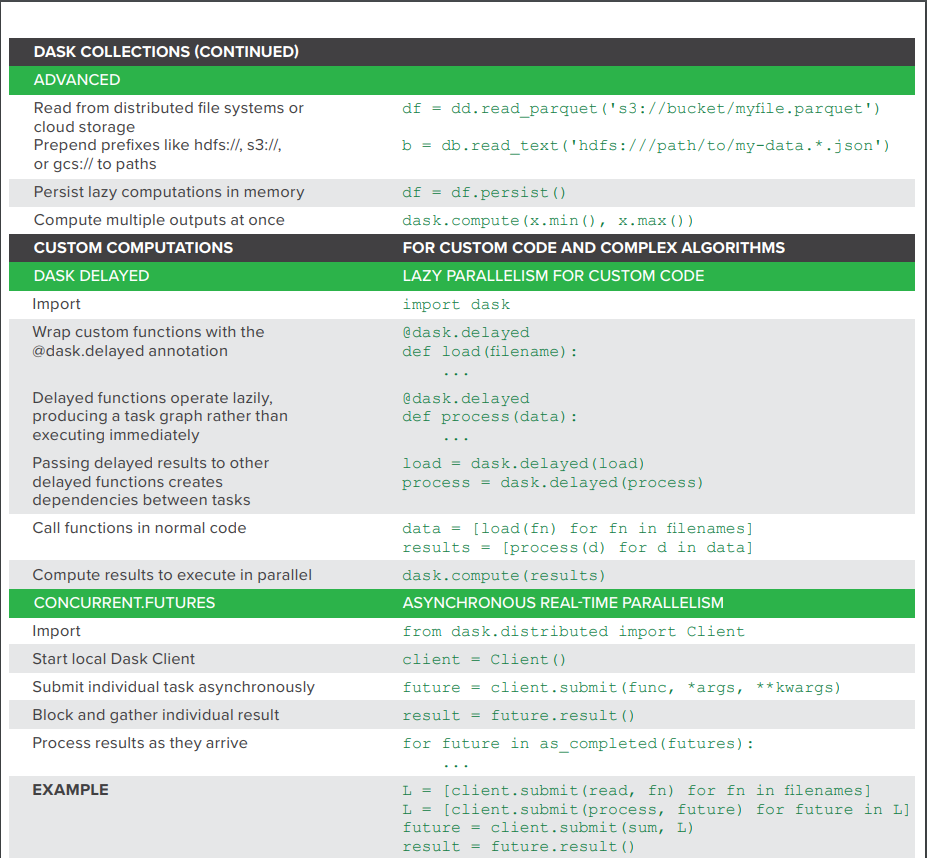  
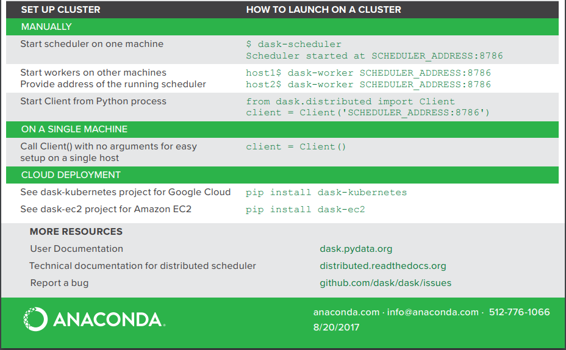  

