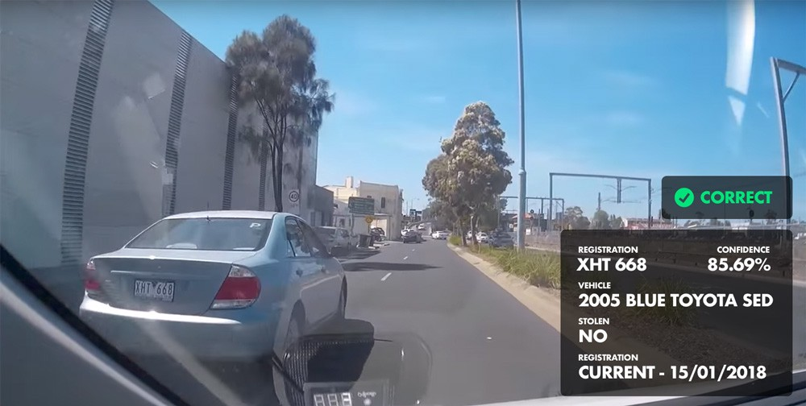
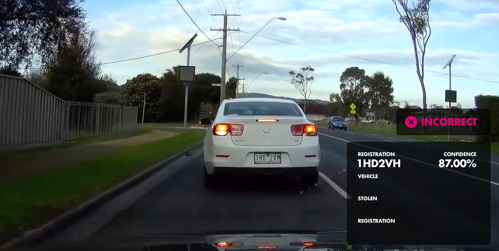
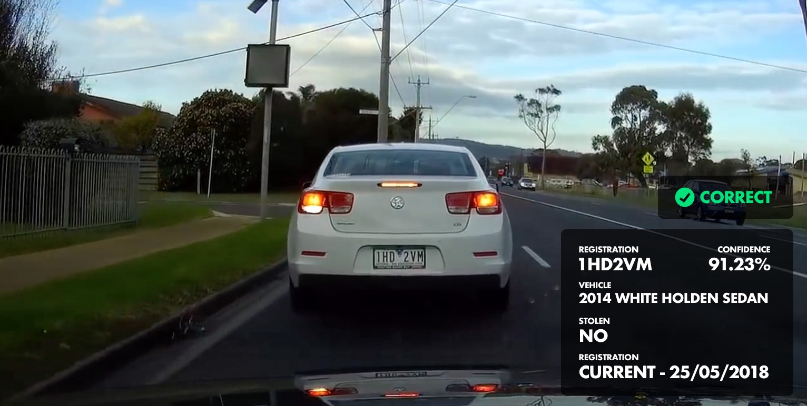

阅读下文有感： 

https://read.acloud.guru/how-i-replicated-an-86-million-project-in-57-lines-of-code-277031330ee9


维多利亚州警察是维多利亚州的主要执法机构。去年，维多利亚州有1.6万多辆车被盗，损失约1.7亿美元。为了打击汽车盗窃案，  
警察局正在试验各种技术驱动的解决方案。他们称这个系统为BlueNet  

为了防止车辆被偷后的欺诈性销售，VicRoads已经推出了一项基于网络的车辆登记查询服务。该部门还投资了一个固定的车牌扫描器  
——一个固定的三脚架照相机，它可以扫描过往车辆，自动识别被盗车辆   

不要问我为什么，有一天下午，我想做一个车载车牌扫描器的原型，如果车辆被盗或未登记，它会自动通知你。了解到这些单独的组件  
是存在的，我想知道将它们连接在一起有多难  

但是，我在谷歌了一下之后，才发现维多利亚警方最近进行了一次类似装置的试验，估计花费在8600万美元左右。一位机敏的评论者  
指出，安装220辆汽车的成本为8600万美元，而每辆汽车的成本却高达390 909美元  

# 成功的标准
在开始之前，我概述了产品设计的几个关键要求  

## 需求#1:图像处理必须在本地执行  
将实时视频传输到中央处理仓库似乎是解决这个问题的效率最低的方法。除了巨大的数据流量开销之外，您还将网络延迟引入到一个
可能已经非常慢的进程中。
尽管集中式机器学习算法只会随着时间的推移变得更精确，但我想知道本地设备实现是否“足够好”。

## 要求#2:它必须与低质量的图像工作  
由于我没有树莓派相机或USB网络摄像头，所以我将使用行车记录仪的镜头-它随时可用，是一个理想的样本数据来源。作为一个额外  
的好处，dashcam视频代表了你所期望的车载摄像头的整体质量  

## 需求#3:它需要使用开源技术来构建  
依赖专有软件意味着每次你要求改变或增强时，你都会被蛰伤——而且以后每次你提出要求时，蛰伤都会继续。使用开源技术是显而易见的  

# 我的解决方案  

在较高的级别上，我的解决方案从dashcam视频中获取图像，通过安装在设备上的本地开源车牌识别系统将其提取出来，查询注册检查  
服务，然后返回显示结果。  
返回到安装在执法车辆上的装置的数据包括车辆的制造和型号(它只用于核实车牌是否被盗)、登记状态以及报告被盗车辆的任何通知  
如果这听起来很简单，那是因为它确实很简单。例如，图像处理都可以由openalpr库来处理  
这就是识别车牌字符所涉及的全部内容:  
```
openalpr.IdentifyLicense(imagePath, function (error, output) {
   // handle result
});
```
> 一个小小的警告  
VicRoads api的公共访问是不可用的，所以在这个原型中通过web抓取来进行车牌检查。虽然通常不赞成-这是一个概念的证明，  
我不是抨击任何人的服务器 
>

这是我的概念验证的粗略样子  
```
// Open form and submit enquire for `rego`
function getInfo(rego) {
	horseman
	  .userAgent('Mozilla/5.0 (Windows NT 6.1; WOW64; rv:27.0) Gecko/20100101 Firefox/27.0')
	  .open(url)
	  .type('#registration-number-ctrl input[type=text]', rego)
	  .click('.btn-holder input')
	  .waitForSelector('.ctrl-holder.ctrl-readonly')
	  .html()
	  .then(function(body) {
	  	console.log(processInfo(body, rego));
	    return horseman.close();
	  });
}

// Scrape the results for key info
function processInfo(html, rego) {
	var $ = cheerio.load(html);
	var vehicle = $('label.label').filter(function() {
	  return $(this).text().trim() === 'Vehicle:';
	}).next().text().trim();

	var stolen = $('label.label').filter(function() {
	  return $(this).text().trim() === 'Stolen status:';
	}).next().text().trim();

	var registration = $('label.label').filter(function() {
	  return $(this).text().trim() === 'Registration status & expiry date:';
	}).next().text().trim();

	return {
		rego,
		vehicle,
		stolen,
		registration
	};
}
```

# 结果  
我得说我感到又惊又喜  
我原以为开源的车牌识别是相当垃圾的。此外，图像识别算法可能不适合澳大利亚车牌。  
该解决方案能够在大范围内识别车牌。  
   
虽然，解决方案偶尔会有特定字母的问题 
  
但是，解决方案最终会使它们正确。  
  

正如您在上面两幅图像中所看到的，在几帧之后，处理图像的置信度从87%跃升到91%以上。  

我有信心，请原谅我的双关语，通过增加采样率，然后根据最高的置信评级排序，可以提高准确性。或者可以设置一个阈值，  
该阈值只接受大于90%的置信度，然后再验证注册号  

这些都是非常直接的代码优先修复，不排除使用本地数据集培训车牌识别软件。  

# 86000000美元的问题  
说句公道话，我完全不知道这8600万美元的数字包括了什么——我也不能说我的开源工具没有经过本地化培训就能达到与pilot BlueNet  
系统相比的准确性  

我希望预算的一部分包括更换几个遗留数据库和软件应用程序，以支持每台车辆每秒几次的高频率、低延迟的车牌查询  

另一方面，每辆车大约391k美元的成本似乎相当高——特别是如果BlueNet不是特别精确，而且没有大规模的IT项目来退役或升级相关系统  

# 未来应用  
虽然很容易陷入“永远在线”的车牌检举网络的奥威尔式本质，但这种技术有许多积极的应用。想象一下，一个被动系统扫描其他驾车者，  
寻找一辆自动向当局和家庭成员通报当前位置和方向的诱拐汽车  

特斯拉汽车已经配备了摄像头和传感器，能够接收在线旅行社的更新——想象一下，把这些变成一个虚拟的好心人车队。Ubers和Lyft司机  
也可以配备这些设备，以大幅增加覆盖面积  

利用开源技术和现有的组件，似乎有可能提供一种回报率更高的解决方案——投资远低于8600万美元  


