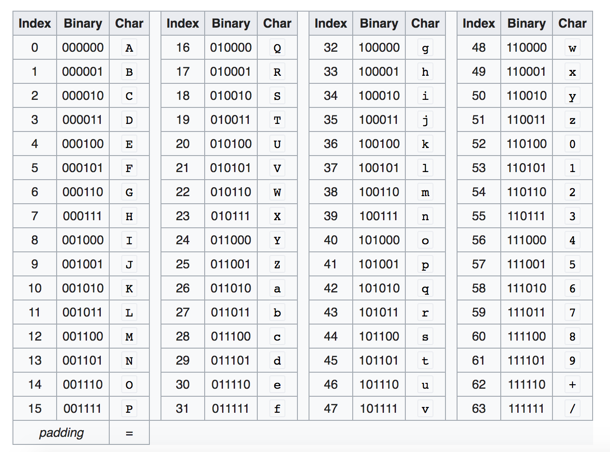

阅读下文有感： 
https://medium.com/swlh/powering-the-internet-with-base64-d823ec5df747  

base64广泛的应用于互联网中，比如url和文件的编码  

Base64是一种二进制到ASCII的编码方案。它被设计成一种可靠地跨通道传输二进制数据的方法，而这些通道对不同内容类型的支持是有限的。  

一个base64de字符串类似这样：V2hhdCBoYXBwZW5zIHdoZW4geW91IGJhc2U2NCgpPw==  

Base64字符只使用与大多数字符集相同的64个字符。它们是:  
* 大写字母字符A-Z  
* 小写字母a-z  
* 0 - 9数字字符  
* 字符+和/  
* =字符用于填充  

这些字符通常由大多数字符集实现，在Internet协议中不经常用作控制字符。因此，当您使用base64编码内容时，您可以相当确信您的数据将不会被破坏。  

然而，当您以“比特和字节”的原始状态传输数据时，数据可能会由于协议对特殊字符的错误解释而搞砸  

## 应用场景  

### 数据传输: 
Base64可以简单地用作传输和存储数据的一种方式，而不会有数据损坏的风险。它通常用于为用户传输JSON数据和cookie信息  

### 数据混淆:
Base64可用于混淆数据，因为产生的文本不是人类可读的。但是，这不能作为一种安全机制，因为编码很容易可逆  

### 数据哈希:
像SHA和MD5这样的数据哈希方案常常产生不可读或不可传输的结果。因此，哈希表几乎都是用base64编码的，这样就可以很容易地显示哈希表并用于文件完整性检查  

### 密码学:
类似地，加密的数据通常包含不容易传输或存储的字节序列。当需要将加密的数据存储在数据库中或通过Internet发送时，通常使用base64。除了密文之外，  
公钥证书和其他加密密钥通常也以base64格式存储  

## 其他传输安全的编码方案
但是为什么base64被如此广泛地使用呢?有没有其他传输安全的编码方案，比如十六进制和十进制?这是因为与其他传输安全的编码方案相比，base64非常紧凑。  
例如，十六进制编码将每个字节编码为一对十六进制字符。这意味着数据的每个字节在编码后将变成两个字节。  
然而Decimal的效率更低:数据的每个字节将表示为三个数字，这意味着未编码数据的每个字节将占用三个字节作为编码数据。  
Base64将每三个字节的数据映射成四个字节的编码数据。  

## base64的原理  
Base64编码将每三个字节的数据(三个字节是3*8=24位)转换成四个Base64字符。
每个6位序列被唯一地映射到使用的64个字符中的一个:  


例如，文本 hi! 的二进制表示形式
01001000 01101001 01001000 
它总共有3个字节(24位)。Base64编码将二进制数据划分为最多6位的块，并根据上表将它们映射到一个Base64字符。
```
010010 | 000110 | 100100 | 100001
S        G        k        h
```

### 填充
当要编码的字符数不是6位的倍数时，将使用0来完成最后的6位序列。
例如，文本Hi的二进制表示为: 
010010 | 000110 | 1001  
为了正确地编码文本，base64将在比特序列的末尾添加0。  
```
010010 | 000110 | 100100 | 
S        G        k        = 
```
所以Hi的base64表示是SGk=。(添加了= padding字符，这样最后一个经过编码的块将有4个base64字符。)  

## base64解码
要解码base64，只需反转上面的操作:  
首先，从编码字符串的末尾删除任何填充字符。  
然后，将每个base64字符转换回它们的六位二进制表示。  
最后，将位划分为字节大小(8位)的块，并将数据转换回原始格式  

## 其他base64实现  
除了上面提到的标准base64编码方案之外，还有许多针对特定用例的base64实现。例如:  
Base64中的文件名使用“-”来代替“/”。这是为了解决Unix和Windows文件名不能包含字符“/”的问题，因为它用于文件路径。  

url的Base64使用“-”和“_”来代替“+”和“/”，并省略了用“=”填充已编码字符串的内容。这是因为URL需要像+、/和=这样的特殊字符  
被编码成%2b、%2f和%3d，这使得编码的字符串不必要地长  
