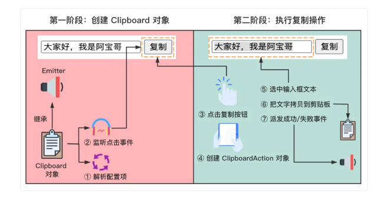

https://mp.weixin.qq.com/s/OJgZWyI5EwDCGZd_wRnSUg  


clipboard.js 

## 特色

no flash, no frameworks

## 依赖：  

Selection,  execCommand API  


## 使用  
```
1. install
npm install clipboard --save  

cdn:  
<script src="https://cdn.jsdelivr.net/npm/clipboard@2.0.6/dist/clipboard.min.js"></script>

2. use

2.1  定义标记
<input id="foo" type="text" value="大家好，我是阿宝哥">
<button class="btn" data-clipboard-action="copy" data-clipboard-target="#foo">复制</button>

2.2 引入
<script src="https://cdn.jsdelivr.net/npm/clipboard@2.0.6/dist/clipboard.min.js"></script>

2.3 实例化
<script>
  var clipboard = new ClipboardJS('.btn');

  clipboard.on('success', function(e) {
    console.log(e);
  });
    
  clipboard.on('error', function(e) {
    console.log(e);
  });
</script>
```

## 核心api

### Selection API
```

<div>大家好，我是<strong>阿宝哥</strong>。欢迎关注<strong>全栈修仙之路</strong></div>
<script>
   let strongs = document.getElementsByTagName("strong");
   let s = window.getSelection();

   if (s.rangeCount > 0) s.removeAllRanges(); // 从选区中移除所有区域
   for (let i = 0; i < strongs.length; i++) {
     let range = document.createRange(); // 创建range区域
     range.selectNode(strongs[i]); // 让range区域包含指定节点及其内容
     s.addRange(range); // 将创建的区域添加到选区中
   }
</script>

```

### execCommand API
```

bool = document.execCommand(aCommandName, aShowDefaultUI, aValueArgument)  
aCommandName：字符串类型，用于表示命令的名称；
aShowDefaultUI：布尔类型，用于表示是否展示用户界面，一般为 false；
aValueArgument：额外参数，一些命令（比如 insertImage）需要额外的参数（提供插入图片的 URL），默认为 null。

static isSupported(action = ['copy', 'cut']) {
  const actions = (typeof action === 'string') ? [action] : action;
  let support = !!document.queryCommandSupported;

  actions.forEach((action) => {
    support = support && !!document.queryCommandSupported(action);
  });

  return support;
}

```


## 源码解析



### Clipboard 类

```
module.exports = {
  entry: './src/clipboard.js',
  mode: 'production',
  output: {
    filename: production ? 'clipboard.min.js' : 'clipboard.js',
    path: path.resolve(__dirname, 'dist'),
    library: 'ClipboardJS',
    globalObject: 'this',
    libraryExport: 'default',
    libraryTarget: 'umd'
  },
  // 省略其他配置信息
}
```


```
import Emitter from 'tiny-emitter';
import listen from 'good-listener';

class Clipboard extends Emitter {
  constructor(trigger, options) {
    super();
    this.resolveOptions(options);
    this.listenClick(trigger);
  }
}
```


```
listenClick(trigger) {
  this.listener = listen(trigger, 'click', (e) => this.onClick(e));
}
```


```
onClick(e) {
  const trigger = e.delegateTarget || e.currentTarget;

  // 为每次点击事件，创建一个新的ClipboardAction对象
  if (this.clipboardAction) {
    this.clipboardAction = null;
  }
  this.clipboardAction = new ClipboardAction({
    action    : this.action(trigger),
    target    : this.target(trigger),
    text      : this.text(trigger),
    container : this.container,
    trigger   : trigger,
    emitter   : this
  });
}
```


```
// src/clipboard.js
resolveOptions(options = {}) {
  this.action = (typeof options.action === 'function') 
    ? options.action :  this.defaultAction;
  this.target = (typeof options.target === 'function') 
    ? options.target : this.defaultTarget;
  this.text = (typeof options.text === 'function')
    ? options.text : this.defaultText;
  this.container = (typeof options.container === 'object')   
    ? options.container : document.body;
}
```


```
// src/clipboard.js
function getAttributeValue(suffix, element) {
  const attribute = `data-clipboard-${suffix}`;
  if (!element.hasAttribute(attribute)) {
    return;
  }
  return element.getAttribute(attribute);
}
```


### ClipboardAction 类

```
// src/clipboard-action.js
class ClipboardAction {
  constructor(options) {
    this.resolveOptions(options);
    this.initSelection();
  }
}

initSelection() {
  if (this.text) {
    this.selectFake();
  } else if (this.target) {
    this.selectTarget();
  }
}

<input id="foo" type="text" value="大家好，我是阿宝哥">
<button class="btn" data-clipboard-action="copy" data-clipboard-target="#foo">复制</button>

// https://github.com/zenorocha/select/blob/master/src/select.js
function select(element) {
  var selectedText;

  if (element.nodeName === 'SELECT') {
    element.focus();
    selectedText = element.value;
  }
  else if (element.nodeName === 'INPUT' || element.nodeName === 'TEXTAREA') {
    var isReadOnly = element.hasAttribute('readonly');

    if (!isReadOnly) {
      element.setAttribute('readonly', '');
    }

    element.select();
    element.setSelectionRange(0, element.value.length);

    if (!isReadOnly) {
      element.removeAttribute('readonly');
    } 
      selectedText = element.value;
    }
  else {
    // 省略相关代码 
  }
  return selectedText;
}


copyText() {
  let succeeded;
  try {
    succeeded = document.execCommand(this.action);
  } catch (err) {
    succeeded = false;
  }
  this.handleResult(succeeded);
}


handleResult(succeeded) {
  this.emitter.emit(succeeded ? 'success' : 'error', {
    action: this.action,
    text: this.selectedText,
    trigger: this.trigger,
    clearSelection: this.clearSelection.bind(this)
  });
}

// src/clipboard.js
class Clipboard extends Emitter {
  onClick(e) {
    const trigger = e.delegateTarget || e.currentTarget;
    // 省略部分代码
    this.clipboardAction = new ClipboardAction({
      // 省略部分属性
      trigger   : trigger,
      emitter   : this // Clipboard 实例
    });
  }
}

let clipboard = new ClipboardJS('.btn');

clipboard.on('success', function(e) {
  console.log(e);
});
    
clipboard.on('error', function(e) {
  console.log(e);
});


// https://github.com/zenorocha/clipboard.js/blob/master/demo/function-text.html
let clipboard = new ClipboardJS('.btn', {
  text: function() {
    return '大家好，我是阿宝哥';
  }
});

// src/clipboard-action.js
class ClipboardAction {
  constructor(options) {
    this.resolveOptions(options);
    this.initSelection();
  }
  
  initSelection() {
    if (this.text) {
      this.selectFake();
    } else if (this.target) {
      this.selectTarget();
    }
  }
}

// src/clipboard-action.js
class ClipboardAction {
  constructor(options) {
    this.resolveOptions(options);
    this.initSelection();
  }
  
  initSelection() {
    if (this.text) {
      this.selectFake();
    } else if (this.target) {
      this.selectTarget();
    }
  }
}


<div>大家好，我是阿宝哥</div>
<button class="btn" data-clipboard-action="copy" data-clipboard-target="div">Copy</button>

function select(element) {
  var selectedText;

  if (element.nodeName === 'SELECT') {
      element.focus();
      selectedText = element.value;
  }
  else if (element.nodeName === 'INPUT' || element.nodeName === 'TEXTAREA') {
      // 省略相关代码 
  }
  else {
     if (element.hasAttribute('contenteditable')) {
        element.focus();
     }

     var selection = window.getSelection(); // 创建选取
     var range = document.createRange(); // 新建区域

     range.selectNodeContents(element); // 使新建的区域包含element节点的内容
     selection.removeAllRanges(); // 移除选取中的所有区域
     selection.addRange(range); // 往选区中添加新建的区域
     selectedText = selection.toString(); // 获取已选中的文本
    }

    return selectedText;
}
```


