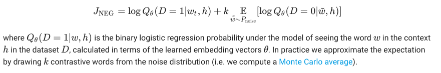

阅读下文有感：  
https://medium.com/explore-artificial-intelligence/word2vec-a-baby-step-in-deep-learning-but-a-giant-leap-towards-natural-language-processing-40fe4e8602ba  

Word2Vec — a baby step in Deep Learning but a giant leap towards Natural Language Processing 
单词向量化--深度学习的一小步，自然语言处理的一大步

著者笔记： 很高兴有那么多的人阅读和发现该文对他们有用。我现在正在工作于一个聊天机器人的的工程。我会上传我的工程经验到  
https://medium.com/explore-artificial-intelligence。 大家不会错过这些精彩的内容，不对吗？-_-  

 Introduction
 Word2Vec model is used for learning vector representations of words called 
 “word embeddings”. This is typically done as a preprocessing step, after 
 which the learned vectors are fed into a discriminative model (typically an 
 RNN(循环神经网络)) to generate predictions and perform all sort of interesting things.

# Why learn word embeddings
Image and audio processing systems work with rich, high-dimensional 
datasets encoded as vectors of the individual raw(未加工的) pixel-intensities for image 
data, thus all the information is encoded in the data hence the relation 
between various entities in the system like (cats and dogs) can be established.

But, when it comes to natural language processing systems traditionally it 
treats words as discrete atomic symbols, and therefore ‘cat’ may be 
represented as Id537 and ‘dog’ as Id143.These encodings are arbitrary(武断的), and 
provide no useful information to the system regarding the relationships that 
may exist between the individual symbols. This means that the model can 
leverage very little of what it has learned about ‘cats’ when it is processing 
data about ‘dogs’ (such that they are both animals, four-legged, pets, etc.).

Representing words as unique, discrete(离散的) ids furthermore leads to data 
sparsity(稀疏), and usually means that we may need more data in order to 
successfully train statistical models. Using vector representations can 
overcome some of these obstacles.

# Let’s take an example-
The traditional approach to NLP involved a lot of domain knowledge of 
linguistics(语言学) itself. Understanding terms such as phonemes and morphemes 
were pretty standard as there are whole linguistic classes dedicated to their 
study. Let’s look at how traditional NLP would try to understand the following word.

Let’s say our goal is to gather some information about this word 
(characterize its sentiment(情绪), find its definition, etc). Using our domain 
knowledge of language, we can break up this word into 3 parts.

以“uninsterested”为例

We understand that the prefix “un” indicates an opposing or opposite idea 
and we know that “ed” can specify the time period (past tense) of the word. 
By recognizing the meaning of the stem word “interest”, we can easily 
deduce the definition and sentiment of the whole word. Seems pretty 
simple right? However, when you consider all the different prefixes and 
suffixes in the English language, it would take a very skilled linguist to 
understand all the possible combinations and meanings.

Deep learning, at its most basic level, is all about representation(表现) learning. 
Here, we’re going to take the same approach by creating representations of 
words through large datasets.

# Word Vectors

例句  
I love NLP and I like dogs  

Let’s represent each word as a d-dimensional vector. Let’s use d = 6. From 
this sentence, we want to create a word vector for each unique word.

Now let’s think about how to fill in the values. We want the values to be 
filled in such a way that the vector somehow represents the word and its 
context, meaning, or semantics（语言学，语义论）. One method is to create a co-occurrence(同现) matrix.

_**A co-occurrence matrix is a matrix that contains the number of 
counts of each word appearing next to all the other words in the corpus 
(or training set). Let’s visualize this matrix.**_

  

Notice that through this simple matrix, we’re able to gain pretty useful 
insights. For example, notice that the words ‘love’ and ‘like’ both contain 1’s 
for their counts with nouns (NLP and dogs). They also have 1’s for the count 
with “I”, thus indicating that the words must be some sort of verb. With a 
larger dataset than just one sentence, you can imagine that this similarity 
will become more clear as ‘like’, ‘love’, and other synonyms(同义词) will begin to 
have similar word vectors, because of the fact that they are used in similar contexts.

Now, although this a great starting point, we notice that the dimensionality(维度)
of each word will increase linearly with the size of the corpus. If we had a 
million words (not really a lot in NLP standards), we’d have a million by 
million sized matrix which would be extremely sparse (lots of 0’s). 
Definitely(当然) not the best in terms of storage efficiency. There have been 
numerous advancements in finding the most optimal(最佳的，最理想的) ways to represent 
these word vectors. The most famous of which is Word2Vec.

# Formal Treatment

Vector space(向量空间) models (VSMs) represent (embed) words in a continuous 
vector space where semantically similar words are mapped to nearby points 
(‘are embedded nearby each other’). VSMs have a long, rich history in NLP, 
but all methods depend in some way or another on the Distributional 
Hypothesis(分布式假设), which states that words that appear in the same contexts share 
semantic meaning. The different approaches(处理) that leverage(利用) this principle can 
be divided into two categories:
* Count-based methods (e.g. Latent Semantic Analysis--潜在语义分析)  
* Predictive methods (e.g. Neural Probabilistic Language Models--神经概率)  

The distinction is -
Count-based methods compute the statistics of how often some word 
co-occurs with its neighbor words in a large text corpus, and then map these 
count-statistics down to a small, dense(密集) vector for each word.

Predictive models directly try to predict a word from its neighbors in terms 
of learned small, dense embedding vectors (considered parameters of the model).

Word2vec is a particularly computationally-efficient predictive model for 
learning word embeddings(词嵌入) from raw text. It comes in two flavors, the 
Continuous Bag-of-Words model (CBOW) and the Skip-Gram model. 
Algorithmically, these models are similar, except that CBOW predicts target 
words from source context words, **_while the skip-gram does the inverse and 
predicts source context-words from the target words._**

We will focus on the skip-gram model in the rest of the discussion. 

# The Mathematics at work

Neural Probabilistic language models are traditionally trained using the 
Maximum Likelihood(最大似然估计) principle to maximize the probability of the next word 
wt (for “target”) given the previous words h (for “history”) in terms of a 
softmax(分类器) function

where score(wt, h) computes the compatibility of the target word wt with 
the context h (a dot product is commonly used).

We train this model by maximizing its log-likelihood(对数似然) on the training set. So, 
let’s maximize the below loss function(损耗函数)-

This yields a properly normalized probabilistic model for language modeling.

This same argument can be also shown in a slightly different formulation 
which clearly shows the choice variable (or the parameter) which is 
changed to maximize this objective.

Our goal is to find word representations that are useful for predicting the 
surrounding words given a current word. In particular, we wish to 
maximize the average log probability across our entire corpus(语料库):

This equation(方程式) essentially(本质上，本来) says that there is some probability p 
of observing a particular word that’s within a window of size c of the current word wt. This 
probability is conditioned on the current word wt and some setting of a 
parameter theta (determined by our model). We wish to set these parameters theta so that this probability is maximized across our entire corpus.

# Basic Parametrization(参数化): Softmax Model
The basic skip-gram model defines the probability p through the softmax 
function as we had seen earlier. If we consider wi to be a one-hot encoded 
vector with dimension N and theta to be a N * K matrix embedding matrix 
where we have N words in our vocabulary and our learned embeddings 
have dimension K, then we can define-

It is worth noting that after learning, the matrix theta can be thought of as 
an embedding lookup matrix.

In terms of(在...方面) architecture it is a simple three-layered neural network.

* Take a 3 layer neural network. (1 input layer + 1 hidden layer + 1 output layer)
* Feed it a word and train it to predict its neighbouring word.
* Remove the last (output layer) and keep the input and hidden layer.
* Now, input a word from within the vocabulary. The output given at the 
hidden layer is the ‘word embedding’ of the input word.

This parametrization has a major disadvantage that limits its usefulness in 
cases of very large corpuses. Specifically, we notice that in order to compute 
a single forward pass of our model, we must sum across the entire corpus 
vocabulary in order to evaluate the softmax function. This is prohibitively(过高的) 
expensive on large datasets, so we look to alternate approximations(近似值) of this 
model for the sake of computational(计算效率) efficiency.

# Improving Computational Efficiency

For feature learning in word2vec we do not need a full probabilistic(概率模型) model. 
The CBOW and skip-gram models are instead trained using a binary 
classification objective (logistic regression--逻辑回归) to discriminate(区别) the real target 
words (wt) from k imaginary (noise) words ~w, in the same context.

Mathematically, the objective (for each example) is to maximize

This objective is maximized when the model assigns high probabilities to 
the real words, and low probabilities to noise words. Technically, this is 
called Negative Sampling, The updates it proposes approximate the updates 
of the softmax function in the limit(在此基础上，提出了在极限条件下对分类函数进行近似更新的方法). 
But computationally it is especially 
appealing because computing the loss function now scales only with the 
number of noise words that we select (k) and not all the words in the 
vocabulary (V).(但是从计算上看，它特别有吸引力，因为计算损失函数现在只与我们选择的噪声单词(k)的数量有关，而不是与词汇表(V)中的所有单词有关。) 
This makes it much faster to train. Packages like Tensorflow 
uses a very similar loss function called noise-contrastive estimation--噪音对比估计 (NCE) loss.

# Intuitive(直观的) Feel of Skip-gram model

the quick brown fox jumped over the lazy dog  

We first form a dataset of words and the contexts in which they appear. For 
now, let’s stick to the vanilla definition and define ‘context’ as the window 
of words to the left and to the right of a target word.(现在，让我们继续使用普通的定义，将“上下文”定义为目标单词左右的单词窗口。)
 Using a window size of 1, we then have the dataset of (context, target) pairs. 
 
([the, brown], quick), ([quick, fox], brown), ([brown, jumped], fox), ...  

Recall that skip-gram inverts contexts and targets, and tries to predict each 
context word from its target word, so the task becomes to predict ‘the’ and 
‘brown’ from ‘quick’, ‘quick’ and ‘fox’ from ‘brown’, etc.

Therefore our dataset becomes of (input, output) pairs as -

(quick, the), (quick, brown), (brown, quick), (brown, fox), ...  

The objective function is defined over the entire dataset, but we typically 
optimize this with with stochastic gradient descent (SGD) using one 
example at a time (or a ‘minibatch’ of batch_size examples, where typically 
16 <= batch_size <= 512). So let’s look at one step of this process.

目标函数是在整个数据集上定义的，但是我们通常使用随机梯度下降(SGD)每次使用一个示例
(或batch_size示例的“小批”，其中通常有16 <= batch_size <= 512)来优化它。
让我们看一下这个过程的一个步骤。

Let’s imagine at training step we observe the first training case above, where 
the goal is to predict the from quick. We select num_noise number of noisy 
(contrastive) examples by drawing from some noise distribution, typically 
the unigram distribution (The unigram posits that each word occurrence is 
independent of all other word occurrences. i.e. we can think of the 
generation process as a sequence of dice rolls as an example.), P(w)

让我们想象一下，在训练步骤中，我们观察上面的第一个训练案例，目标是预测from quick。
我们通过从一些噪声分布(通常是一元模型分布，一元模型假定每个单词的出现独立于所有其他单词的出现)
中提取噪声(对比)示例的num_noise数量。也就是说，我们可以把生成过程看作骰子滚动的序列。)，P(w)

For simplicity let’s say num_noise=1 and we select sheep as a noisy example.
 Next we compute the loss for this pair of observed and noisy examples, i.e. 
 the objective at time step ‘t’ becomes -
 
 为了简单起见，我们假设num_noise=1，并选择sheep作为一个有噪声的示例。接下来，我们计算这对
 观测到的和有噪声的例子的损失，即目标在时间步长t变为-

The goal is to make an update to the embedding parameters theta to 
maximize this objective function. We do this by deriving the gradient of the 
loss with respect to the embedding parameters theta

We then perform an update to the embeddings by taking a small step in the 
direction of the gradient. When this process is repeated over the entire 
training set, this has the effect of ‘moving’ the embedding vectors around for 
each word until the model is successful at discriminating real words from noise words.

然后，我们通过在梯度方向上迈出一小步来执行对嵌入的更新。当这个过程在整个训练集中重复时，
它的效果是“移动”每个单词的嵌入向量，直到模型成功地区分出真实单词和噪声单词。

We can visualize the learned vectors by projecting them down to 2 dimensions.
 When we inspect these visualizations it becomes apparent that the vectors 
 capture some general, and in fact quite useful, semantic information about
  words and their relationships to one another.

我们可以把学过的向量投影到二维空间中来形象化。当我们检查这些可视化时，很明显，
这些向量捕获了一些关于单词及其相互关系的一般的、实际上非常有用的语义信息。

My Next Blog
An Introduction to Recurrent Neural Networks

Sources
* [Tensorflow implementation of Word2Vec](https://www.tensorflow.org/tutorials/word2vec)
* [Distributed Representations of Words and Phrases and their Compositionally — A research paper by Thomas Mikolov, Ilya Sutskever, Kai Chen, Greg Corrado and Jeffrey Dean](https://papers.nips.cc/paper/5021-distributed-representations-of-words-and-phrases-and-their-compositionality.pdf)
* [A practical guide to word2vec by Aneesh Joshi](https://towardsdatascience.com/learn-word2vec-by-implementing-it-in-tensorflow-45641adaf2ac)
* [Natural Language Processing Review by Adit Deshpande](https://adeshpande3.github.io/adeshpande3.github.io/Deep-Learning-Research-Review-Week-3-Natural-Language-Processing)
* [Language Model by Rohan Verma](http://rohanvarma.me/Word2Vec/)

